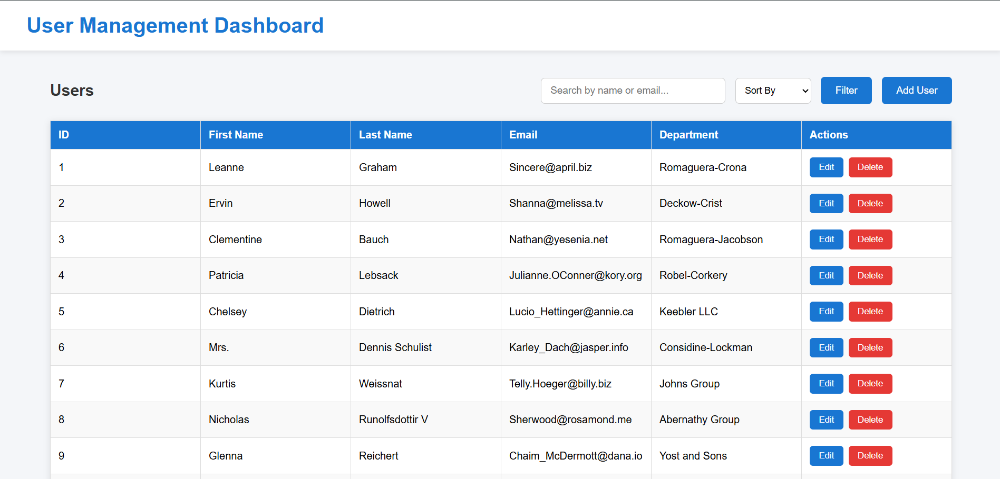
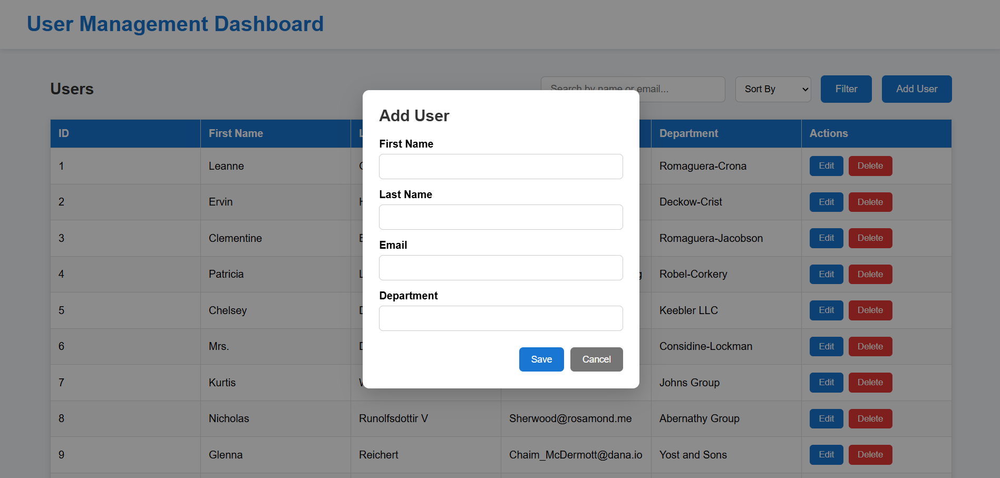
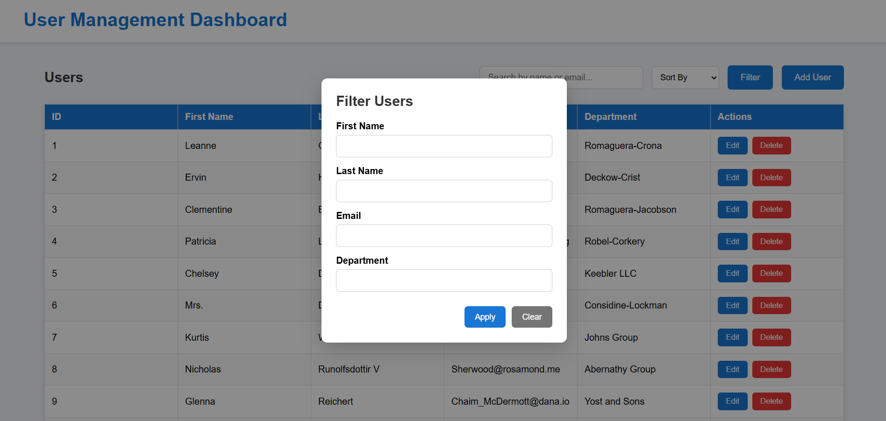

# User Management Dashboard

A responsive User Management Dashboard built with **React**, **Axios**, and the **JSONPlaceholder API**. This project demonstrates CRUD operations, API integration, state management, and a clean component-based architecture.

## 🚀 Features

- Fetch users from JSONPlaceholder API
- Add new users
- Edit existing users
- Delete users
- Search users by first name, last name, email, or department
- Sort users by first name, last name, or department
- Filter users using a dedicated filter modal
- Client-side pagination (10, 25, 50, 100 users per page)
- Form validation
- Responsive user interface

---

## 🛠 Tech Stack

- React (Vite)
- JavaScript (ES6+)
- Axios
- HTML5
- CSS3
- JSONPlaceholder REST API

---

## 📂 Project Structure

```
src
├── api
│   └── axios.js
├── components
│   ├── FilterModal.jsx
│   ├── Navbar.jsx
│   ├── Pagination.jsx
│   ├── SearchBar.jsx
│   ├── UserForm.jsx
│   └── UserTable.jsx
├── pages
│   └── Dashboard.jsx
├── styles
│   └── style.css
├── App.jsx
└── main.jsx
```

---

## ⚙️ Installation

Clone the repository

```bash
git clone https://github.com/kratagya394/user-management-dashboard.git
```

Navigate to the project folder

```bash
cd user-management-dashboard
```

Install dependencies

```bash
npm install
```

Run the development server

```bash
npm run dev
```

Open your browser and visit

```
http://localhost:5173
```

---

## 🌐 API

This project uses the JSONPlaceholder REST API.

**Base URL**

```
https://jsonplaceholder.typicode.com/users
```

HTTP methods used:

- GET
- POST
- PUT
- DELETE

---

## 📸 Preview

### Dashboard

> 

### Add User

> 

### Filter Users

> 

---

## 🔮 Future Improvements

- Backend database integration
- Authentication & Authorization
- Export users to CSV/PDF
- Advanced filtering options
- Unit testing

---

## 👨‍💻 Author

**Kratagya Verma**

GitHub: https://github.com/kratagya394

LinkedIn: https://www.linkedin.com/in/kratagya-verma-749692235/

Email: kratagyaverma394@gmail.com

---

